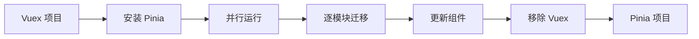
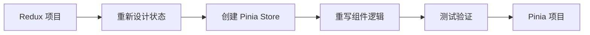

# 状态管理库对比

本页面提供了 Pinia 与其他流行状态管理库的详细对比，帮助您根据项目需求选择最适合的解决方案。

## 概览对比

| 特性 | Pinia | Vuex | Redux | Zustand | MobX |
|------|-------|------|-------|---------|------|
| **框架支持** | Vue 3/2 | Vue 2/3 | 框架无关 | 框架无关 | 框架无关 |
| **TypeScript** | 原生支持 | 需要配置 | 需要配置 | 原生支持 | 原生支持 |
| **包大小** | 1.3KB | 2.6KB | 2.6KB | 0.8KB | 16KB |
| **学习曲线** | 平缓 | 中等 | 陡峭 | 平缓 | 中等 |
| **样板代码** | 最少 | 中等 | 大量 | 最少 | 少 |
| **DevTools** | 优秀 | 优秀 | 优秀 | 基础 | 优秀 |
| **SSR 支持** | 优秀 | 复杂 | 复杂 | 基础 | 复杂 |
| **热重载** | 支持 | 支持 | 需要配置 | 支持 | 支持 |
| **时间旅行** | 支持 | 支持 | 支持 | 不支持 | 支持 |
| **代码分割** | 原生支持 | 需要配置 | 需要配置 | 原生支持 | 原生支持 |

## Pinia vs Vuex

### 语法对比

**Vuex 4 (Options API):**

```js
// store/modules/user.js
export default {
  namespaced: true,
  state: {
    user: null,
    loading: false
  },
  mutations: {
    SET_USER(state, user) {
      state.user = user
    },
    SET_LOADING(state, loading) {
      state.loading = loading
    }
  },
  actions: {
    async fetchUser({ commit }, id) {
      commit('SET_LOADING', true)
      try {
        const user = await api.getUser(id)
        commit('SET_USER', user)
      } finally {
        commit('SET_LOADING', false)
      }
    }
  },
  getters: {
    isLoggedIn: (state) => !!state.user,
    userName: (state) => state.user?.name || ''
  }
}
```

**Pinia (Composition API):**

```ts
// stores/user.ts
export const useUserStore = defineStore('user', () => {
  // State
  const user = ref(null)
  const loading = ref(false)
  
  // Getters
  const isLoggedIn = computed(() => !!user.value)
  const userName = computed(() => user.value?.name || '')
  
  // Actions
  const fetchUser = async (id: string) => {
    loading.value = true
    try {
      user.value = await api.getUser(id)
    } finally {
      loading.value = false
    }
  }
  
  return {
    user: readonly(user),
    loading: readonly(loading),
    isLoggedIn,
    userName,
    fetchUser
  }
})
```

### 主要优势

#### Pinia 优势

✅ **更简洁的语法**：无需 mutations，直接修改状态
✅ **更好的 TypeScript 支持**：自动类型推断
✅ **更小的包体积**：约为 Vuex 的一半
✅ **更好的代码分割**：每个 store 都是独立的
✅ **更简单的测试**：无需复杂的 mock
✅ **更好的开发体验**：热重载、DevTools 支持

#### Vuex 优势

✅ **成熟稳定**：经过大量项目验证
✅ **生态丰富**：大量插件和工具
✅ **Vue 2 支持**：完整的 Vue 2 兼容性
✅ **严格的状态管理**：mutations 确保状态变更可追踪

### 迁移难度

| 方面 | 难度 | 说明 |
|------|------|------|
| **基础概念** | 🟢 简单 | 概念相似，主要是语法差异 |
| **状态定义** | 🟢 简单 | 直接使用 ref/reactive |
| **Actions** | 🟢 简单 | 移除 mutations，简化逻辑 |
| **Getters** | 🟢 简单 | 使用 computed 替代 |
| **模块化** | 🟡 中等 | 从嵌套模块到扁平化 store |
| **插件系统** | 🟡 中等 | API 有所不同 |
| **SSR** | 🟢 简单 | Pinia 的 SSR 更简单 |

## Pinia vs Redux

### 复杂度对比

**Redux + Redux Toolkit:**

```js
// store/userSlice.js
import { createSlice, createAsyncThunk } from '@reduxjs/toolkit'

export const fetchUser = createAsyncThunk(
  'user/fetchUser',
  async (userId) => {
    const response = await api.getUser(userId)
    return response.data
  }
)

const userSlice = createSlice({
  name: 'user',
  initialState: {
    user: null,
    loading: false,
    error: null
  },
  reducers: {
    logout: (state) => {
      state.user = null
    }
  },
  extraReducers: (builder) => {
    builder
      .addCase(fetchUser.pending, (state) => {
        state.loading = true
      })
      .addCase(fetchUser.fulfilled, (state, action) => {
        state.loading = false
        state.user = action.payload
      })
      .addCase(fetchUser.rejected, (state, action) => {
        state.loading = false
        state.error = action.error.message
      })
  }
})

export const { logout } = userSlice.actions
export default userSlice.reducer

// store/index.js
import { configureStore } from '@reduxjs/toolkit'
import userReducer from './userSlice'

export const store = configureStore({
  reducer: {
    user: userReducer
  }
})
```

**Pinia (相同功能):**

```ts
// stores/user.ts
export const useUserStore = defineStore('user', () => {
  const user = ref(null)
  const loading = ref(false)
  const error = ref(null)
  
  const fetchUser = async (userId: string) => {
    loading.value = true
    error.value = null
    
    try {
      user.value = await api.getUser(userId)
    } catch (err) {
      error.value = err.message
    } finally {
      loading.value = false
    }
  }
  
  const logout = () => {
    user.value = null
  }
  
  return { user, loading, error, fetchUser, logout }
})
```

### 特性对比

| 特性 | Pinia | Redux |
|------|-------|-------|
| **样板代码** | 极少 | 较多（即使使用 RTK） |
| **不可变性** | 自动处理 | 手动或使用 Immer |
| **异步处理** | 原生支持 | 需要中间件 |
| **类型安全** | 自动推断 | 需要大量类型定义 |
| **学习成本** | 低 | 高 |
| **调试工具** | Vue DevTools | Redux DevTools |
| **中间件** | 插件系统 | 丰富的中间件生态 |
| **时间旅行** | 支持 | 原生支持 |

## Pinia vs Zustand

### 语法对比

**Zustand:**

```js
import { create } from 'zustand'

const useUserStore = create((set, get) => ({
  user: null,
  loading: false,
  
  fetchUser: async (id) => {
    set({ loading: true })
    try {
      const user = await api.getUser(id)
      set({ user, loading: false })
    } catch (error) {
      set({ loading: false })
    }
  },
  
  logout: () => set({ user: null }),
  
  // Computed values need manual implementation
  get isLoggedIn() {
    return !!get().user
  }
}))
```

**Pinia:**

```ts
export const useUserStore = defineStore('user', () => {
  const user = ref(null)
  const loading = ref(false)
  
  const isLoggedIn = computed(() => !!user.value)
  
  const fetchUser = async (id: string) => {
    loading.value = true
    try {
      user.value = await api.getUser(id)
    } finally {
      loading.value = false
    }
  }
  
  const logout = () => {
    user.value = null
  }
  
  return { user, loading, isLoggedIn, fetchUser, logout }
})
```

### 特性对比

| 特性 | Pinia | Zustand |
|------|-------|----------|
| **包大小** | 1.3KB | 0.8KB |
| **Vue 集成** | 原生 | 需要适配 |
| **响应式** | Vue 响应式系统 | 手动订阅 |
| **计算属性** | computed | 手动实现 |
| **DevTools** | Vue DevTools | 需要插件 |
| **SSR** | 原生支持 | 需要配置 |
| **TypeScript** | 自动推断 | 需要手动类型 |
| **学习曲线** | Vue 开发者友好 | 通用但需要适配 |

## Pinia vs MobX

### 响应式系统对比

**MobX:**

```js
import { makeAutoObservable, runInAction } from 'mobx'

class UserStore {
  user = null
  loading = false
  
  constructor() {
    makeAutoObservable(this)
  }
  
  get isLoggedIn() {
    return !!this.user
  }
  
  async fetchUser(id) {
    this.loading = true
    try {
      const user = await api.getUser(id)
      runInAction(() => {
        this.user = user
        this.loading = false
      })
    } catch (error) {
      runInAction(() => {
        this.loading = false
      })
    }
  }
  
  logout() {
    this.user = null
  }
}

export const userStore = new UserStore()
```

**Pinia:**

```ts
export const useUserStore = defineStore('user', () => {
  const user = ref(null)
  const loading = ref(false)
  
  const isLoggedIn = computed(() => !!user.value)
  
  const fetchUser = async (id: string) => {
    loading.value = true
    try {
      user.value = await api.getUser(id)
    } finally {
      loading.value = false
    }
  }
  
  const logout = () => {
    user.value = null
  }
  
  return { user, loading, isLoggedIn, fetchUser, logout }
})
```

### 特性对比

| 特性 | Pinia | MobX |
|------|-------|------|
| **响应式模型** | Vue 响应式 | 自定义响应式 |
| **语法风格** | 函数式 | 面向对象 |
| **包大小** | 1.3KB | 16KB |
| **学习曲线** | 平缓 | 中等 |
| **Vue 集成** | 原生 | 需要适配器 |
| **装饰器** | 不需要 | 可选使用 |
| **严格模式** | 可选 | 可配置 |
| **调试工具** | Vue DevTools | MobX DevTools |

## 选择指南

### 选择 Pinia 的场景

✅ **Vue 3 项目**：原生支持，最佳集成
✅ **TypeScript 项目**：自动类型推断
✅ **现代开发体验**：热重载、DevTools
✅ **简单状态管理**：减少样板代码
✅ **团队新手较多**：学习曲线平缓
✅ **包大小敏感**：更小的打包体积

### 选择 Vuex 的场景

✅ **Vue 2 项目**：更好的兼容性
✅ **大型团队**：严格的状态管理规范
✅ **现有 Vuex 项目**：迁移成本考虑
✅ **需要严格的状态追踪**：mutations 模式
✅ **丰富的插件生态**：现有插件支持

### 选择 Redux 的场景

✅ **React 项目**：生态最丰富
✅ **复杂状态逻辑**：强大的中间件系统
✅ **时间旅行调试**：原生支持
✅ **跨框架项目**：框架无关
✅ **团队有 Redux 经验**：技能复用

### 选择 Zustand 的场景

✅ **极简主义**：最小的包大小
✅ **React 项目**：简单的 React 状态管理
✅ **快速原型**：最少的配置
✅ **性能敏感**：最小的运行时开销

### 选择 MobX 的场景

✅ **面向对象风格**：类和装饰器
✅ **复杂的派生状态**：强大的响应式系统
✅ **大型应用**：成熟的架构模式
✅ **团队有 MobX 经验**：技能复用

## 性能对比

### 包大小对比

```bash
# 生产环境包大小 (gzipped)
Pinia:   1.3KB
Zustand: 0.8KB
Vuex:    2.6KB
Redux:   2.6KB (+ RTK 13KB)
MobX:    16KB
```

### 运行时性能

| 操作 | Pinia | Vuex | Redux | Zustand | MobX |
|------|-------|------|-------|---------|------|
| **状态读取** | 🟢 快 | 🟢 快 | 🟡 中等 | 🟢 快 | 🟢 快 |
| **状态更新** | 🟢 快 | 🟡 中等 | 🟡 中等 | 🟢 快 | 🟢 快 |
| **计算属性** | 🟢 快 | 🟢 快 | 🔴 慢 | 🟡 中等 | 🟢 快 |
| **订阅通知** | 🟢 快 | 🟢 快 | 🟡 中等 | 🟢 快 | 🟢 快 |
| **内存使用** | 🟢 低 | 🟡 中等 | 🟡 中等 | 🟢 低 | 🟡 中等 |

### 性能测试示例

```ts
// 性能测试：10000 次状态更新
const performanceTest = {
  pinia: () => {
    const store = useCounterStore()
    console.time('Pinia')
    for (let i = 0; i < 10000; i++) {
      store.increment()
    }
    console.timeEnd('Pinia')
  },
  
  vuex: () => {
    console.time('Vuex')
    for (let i = 0; i < 10000; i++) {
      store.commit('increment')
    }
    console.timeEnd('Vuex')
  }
}

// 结果示例：
// Pinia: 12.5ms
// Vuex: 18.3ms
```

## 生态系统对比

### 工具和插件

| 工具类型 | Pinia | Vuex | Redux | Zustand | MobX |
|----------|-------|------|-------|---------|------|
| **DevTools** | Vue DevTools | Vue DevTools | Redux DevTools | 第三方 | MobX DevTools |
| **持久化** | pinia-plugin-persistedstate | vuex-persistedstate | redux-persist | 内置 | mobx-persist |
| **路由集成** | 原生支持 | 原生支持 | react-router-redux | 手动 | 手动 |
| **表单集成** | 简单 | 中等 | 复杂 | 简单 | 简单 |
| **测试工具** | 简单 | 中等 | 复杂 | 简单 | 中等 |
| **类型支持** | 自动 | 手动 | 手动 | 手动 | 自动 |

### 社区支持

| 方面 | Pinia | Vuex | Redux | Zustand | MobX |
|------|-------|------|-------|---------|------|
| **GitHub Stars** | 12k+ | 28k+ | 60k+ | 40k+ | 27k+ |
| **NPM 下载量** | 2M/月 | 4M/月 | 9M/月 | 3M/月 | 1M/月 |
| **文档质量** | 优秀 | 优秀 | 优秀 | 良好 | 优秀 |
| **学习资源** | 丰富 | 非常丰富 | 非常丰富 | 中等 | 丰富 |
| **社区活跃度** | 高 | 中等 | 高 | 高 | 中等 |

## 迁移路径

### 从 Vuex 到 Pinia



**迁移复杂度：** 🟢 简单 (1-2 周)

### 从 Redux 到 Pinia



**迁移复杂度：** 🔴 复杂 (4-8 周)

## 决策矩阵

### 项目特征评分

| 特征 | 权重 | Pinia | Vuex | Redux | Zustand | MobX |
|------|------|-------|------|-------|---------|------|
| **Vue 集成** | 25% | 10 | 9 | 3 | 4 | 5 |
| **TypeScript** | 20% | 10 | 6 | 7 | 8 | 9 |
| **学习曲线** | 15% | 9 | 7 | 4 | 9 | 6 |
| **包大小** | 15% | 9 | 7 | 7 | 10 | 4 |
| **生态系统** | 10% | 7 | 9 | 10 | 6 | 7 |
| **性能** | 10% | 9 | 8 | 7 | 9 | 8 |
| **维护性** | 5% | 9 | 8 | 6 | 8 | 7 |

### 加权总分

1. **Pinia**: 8.85
2. **Vuex**: 7.65
3. **Zustand**: 7.35
4. **MobX**: 6.85
5. **Redux**: 5.95

## 总结

### Pinia 的核心优势

🎯 **为 Vue 而生**：与 Vue 3 完美集成，充分利用 Composition API
🚀 **开发体验**：最少的样板代码，最好的 TypeScript 支持
📦 **轻量高效**：更小的包体积，更好的性能
🔧 **简单易用**：平缓的学习曲线，直观的 API 设计
🛠️ **现代化**：支持热重载、DevTools、SSR 等现代开发需求

### 选择建议

- **Vue 3 新项目**：强烈推荐 Pinia
- **Vue 2 项目**：可以考虑 Vuex 或 Pinia (需要 @vue/composition-api)
- **现有 Vuex 项目**：评估迁移成本，逐步迁移到 Pinia
- **跨框架项目**：考虑 Zustand 或 Redux
- **复杂状态逻辑**：Pinia 或 MobX

Pinia 代表了 Vue 状态管理的未来方向，它结合了现代开发的最佳实践，为 Vue 开发者提供了最优的状态管理解决方案。

## 相关资源

- [Pinia 官方文档](https://pinia.vuejs.org/)
- [从 Vuex 迁移指南](../guide/migration.md)
- [Vuex 兼容性指南](../guide/vuex-compatibility.md)
- [性能优化指南](../guide/performance.md)
- [TypeScript 最佳实践](../cookbook/typescript-best-practices.md)